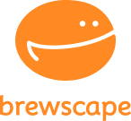
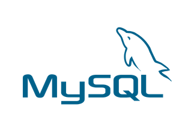

<div align="center">
	


</div>

# ☕ brewscape - 카페로그
#### "공부하기 좋은 카페 없나? 커피가 맛있는 카페 없나?"
* 카페로그는 여러 장소 중에서도 카페 위주의 리뷰를 모아보고 싶은 사용자들을 위한 웹서비스입니다.
* 개개인의 취향에 따라 카페를 탐색하고 기록할 수 있습니다.

<br>

## 📅 개발 기간
#### `2024.12.13 ~ 2025.2.6 (2개월)`

<br>

## 🏃 팀원 소개
|[김병찬](https://github.com/팀원1아이디)|[문남경](https://github.com/팀원2아이디)| [이승헌](https://github.com/팀원3아이디) |[임용태](https://github.com/팀원4아이디)| [이주연](https://github.com/leejuyeon-star)|
| :-------------------------: | :-------------------------: | :----------------------: | :-----------------------: | :-----------------------: |
| Backend | UI/UX Design | Frontend | Frontend | Backend |
|  |  |  |  |  |


<br>

## 🔍 주요 기능

| **카페 검색** | **카페 상세페이지** |
|:---:|:---:|
|  |  | 
| **리뷰 필터링 조회** | **리뷰 작성, 임시저장** |
|  |  | 
| **회원가입, 로그인** | **마이페이지** |
|  |  | 
| **카페 스크랩** |
|  |
<br>

## 🧩 어플리케이션 흐름


<br>

## 📚 기술 스택

### 프론트
|  |  |  |  |   |
|----------------------------|------------------------------|------------------------------------------|--------------------------|-------------------------------|
| ?                    | ?                        | ?                              | ?                   | ?                |

### 백엔드 
|  |  |  |  |   |
|----------------------------|------------------------------|------------------------------------------|--------------------------|-------------------------------|
| Java 21                    | gradle                       | Spring Boot                              |  Oauth2         | Spring Security               |


|  |  |  |  |  |
|--------------------------|------------------------------|----------------------------------|------------------------------|------------------------------|
|  Spring Data JPA         |  QueryDSL                    | Redis                            | MySQL 8                      | ElastiCache                  |


|  |  |
|------------------------------------|------------------------------|
|  Mockito                           | Junit 5                      |


### DevOps
|  |  |  |  |
|--------------------------------------|------------------------------|----------------------------|--------------------------------------------|
| Github Actions                       | Docker                       |  AWS EC2                          |   AWS RDS                                  |

### 협업툴
|  |  |  |  |
|------------------------------|----------------------------------|--------------------------------|----------------------------------|
| Github                       | notion                           | Figma                          | Discord                           |

<br>

## 🌟 주요 기능 구현
- [김병찬]
  - 로그인/회원가입
    - oauth2를 이용
    - access, refresh 토큰을 이용하여
  - 카페 조회
    - 네이버 API를 이용한 카페 정보 최신화
- [이주연]
    - 이미지 관련 기능
      - 이미지 저장시 서버 내부에 저장
    - 리뷰 임시저장 기능
        - 임시저장 개별 테이블 생성하여 관리
    - 리뷰 필터링 조회
      - SQL 쿼리를 사용한 필터링
      
    - 
    - 기능 테스트
      - 통합 테스트 코드 작성

<br>

## 📊 ERD 설계

## 🗺️ 시스템 아키텍쳐 구성도

## ⚽ 트러블 슈팅
<details>
<summary> 김병찬 </summary>
	
<details>
<summary>~~~문제</summary>

##### `🤔문제 발생`
* 나나
##### `🔍원인 분석`
* 나나
##### `⛏해결 과정`
* 나나
  ```java
  자바 코드
  system.out.println()
  ```
  ```javascript
  자바스크립트 코드
  console.log()
  ```
##### `💎결론`
* 나나
</details>

<details>
<summary>~~~문제</summary>

##### `🤔문제 발생`
* 나나
##### `🔍원인 분석`
* 나나
##### `⛏해결 과정`
* 나나
##### `💎결론`
* 나나
</details>
</details>

<details>
<summary> 문남경 </summary>
</details>
<details>
<summary> 이승헌 </summary>
</details>
<details>
<summary> 임용태 </summary>
</details>
<details>
<summary> 이주연 </summary>
</details>


## 🔗 프로젝트 문서
* [노션](https://www.notion.so/18fc5e41552d81bfa985c870e5c2fed4)
* [포스트맨](https://www.postman.com/cafelog/cafelog-team/overview)
* [피그마](https://www.figma.com/design/UPFpjUYoJa0nx1GiQNktp0/%5B2025-%ED%8C%80-%ED%94%84%EB%A1%9C%EC%A0%9D%ED%8A%B8%5D-%EC%BB%A4%ED%94%BC-%EA%B8%B0%EB%A1%9D?node-id=0-1&t=0iUqRTZvxP7KlhpO-1)

